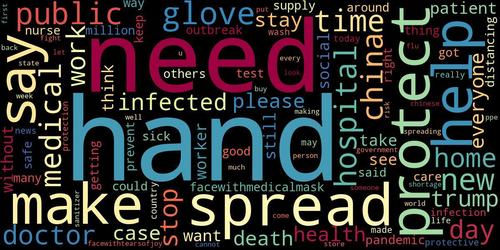

# #Masks Throughout COVID-19: A Twitter Sentiment Analysis

## Approach
Using [twint](https://github.com/twintproject/twint) to scrape Twitter, we perform natural language processing (NLP) techniques to analyze the sentiment of tweets relating to masks and coronavirus and classify them as Negative, Neutral or Positive. Through text processing, exploratory data analysis and feature engineering, we discover insights into how important words, topics, and subjectivity relate to sentiment. We then create predictive models to provide further insight and confirm our findings during EDA.

### Some questions:
* How does the sentiment of tweets change over time?
    * Hypothesis: Tweets will be more negative on average in January and get more positive on average as time goes on.
* Will Twitter stats (number of likes, replies, retweets) play a role in determining sentiment?
    * Hypothesis: The most important features will most likely be the words themselves.
* Does topic modeling provide any insight toward tweet sentiment or the COVID-19 crisis?
    * Hypothesis: Topic modeling should be a factor in determining sentiment and can give us insights into the pandemic.
* What insights can be provided by using machine learning?
    * Hypothesis: The lion's share of the insights will come during EDA.
* What are the most frequent words? And do they play a role in determining sentiment?

## Findings
- Tweets were generally more negative in January but relatively constant from February through May (there were also far fewer relevant tweets in January).
- After removing common English stopwords as well as topical stopwords like mask, and virus, the top ten most frequently occuring words were: hand, need, spread, protect, make, help, say, glove, public, and hospital.
- Topic modeling provided some interesting insights but was not helpful in prediction modeling.
- Some of the features that prediction models weighed the heaviest were quite surprising:
	- Subjectivity Score
	- Number of likes
	- Number of retweets

## Most prevalent features in the model (in order)
### 10 most common words (after removing stopwords):
    'need'
    'spread'
    'protect'
    'make'
    'help'
    'say'
    'glove'
    'public'
    'hospital'
    'new'

### 10 best features (Decision Tree Classifier):
    Subjectivity score  (0.0611)
    Number of likes     (0.0139)
    'protect'           (0.0132)
    'help'              (0.0129)
    'infected'          (0.0115)
    'safe'              (0.0094)
    'please'            (0.0083)
    'death'             (0.0083)
    'hand'              (0.0076)
    Number of replies   (0.0072)

### 10 topic summaries (via LDA):
    0.   Healthcare workers, hospitals
    1.   Social distancing
    2.   Protesting, lockdowns
    3.   Government, health organizations
    4.   Spreading the virus
    5.   Emojis, swear words
    6.   COVID19 statistics
    7.   Preventing infection
    8.   General opinions
    9.   Riots, BLM

# Final conclusion
* I can run my final model on the data collected by volunteers and compile a list of trees that whose health statuses do not line up. In the meantime, the NYC Street Trees Census is fairly thorough and rife with opportunities for data exploration and predictive modeling. Perhaps with a neural network, I could greatly improve my model. In future censuses, even more data could be gathered (especially in regard to specificity) that will increase these opportunities for prediction even further.

## List of files

## Visualizations

### BLOG POST FORTHCOMING

